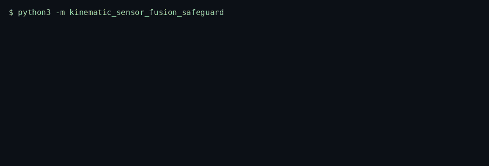
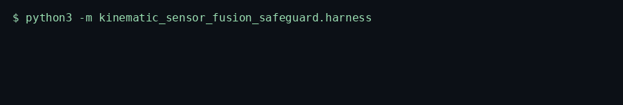
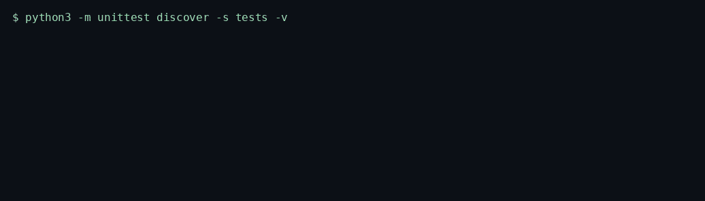

# Kinematic Sensor Fusion Safeguard

> Fuses IMU acceleration and GPS on three independent constant-velocity Kalman filters and drops updates that fail a chi-square gate.

<p>
  <a href="https://github.com/TechieGoku2623/kinematic-sensor-fusion-safeguard/actions/workflows/ci.yml"></a>
  
  
</p>

| | |
| --- | --- |
| **Website** | https://github.com/TechieGoku2623/kinematic-sensor-fusion-safeguard |
| **Topics** | `python` `asyncio` `aerospace` `kalman-filter` `sensor-fusion` `imu` |

## Walkthrough

Three recordings from this repository. Each one is the command in the frame, not a drawing.

### Engine

`python3 -m kinematic_sensor_fusion_safeguard`



Acceleration above 12 g is rejected. A sequence gap is predict-only. IMU and GPS clocks that disagree past the skew budget raise.

### Benchmark

`python3 -m kinematic_sensor_fusion_safeguard.harness`



5000 IMU iterations. `random.Random(178)`. The frame ends on the status line and `echo $?`.

### Tests

`python3 -m unittest discover -s tests -v`



Wire round-trip, the happy path, and both edge cases below.

## Pipeline

```
IMU / GPS frame
  |
  v
per-axis predict  F = [[1, dt], [0, 1]]
  |
  v
innovation^2 / S > gate? -- yes --> reject update
  |
  no
  v
{position, velocity, rejected_updates, dropouts}
```

## Quick start

```bash
python3 -m venv venv
source venv/bin/activate
pip install -e ".[dev]"
python -m kinematic_sensor_fusion_safeguard
python -m kinematic_sensor_fusion_safeguard.harness
python -m unittest discover -s tests -v
```

Python 3.12. The runtime is the standard library. `black` and `flake8` are the `dev` extra.

## Use it

```python
import asyncio

from kinematic_sensor_fusion_safeguard import KinematicSensorFusionSafeguard


async def demo() -> None:
    fusion = KinematicSensorFusionSafeguard()
    report = await fusion.run(
        [
            {
                "kind": 1,
                "seq": 1,
                "t_ns": 1_000_000_000,
                "ax": 0.2,
                "ay": 0.0,
                "az": 0.0,
            }
        ]
    )
    velocity_x = float(report["velocity"][0])
    position_x = float(report["position"][0])
    print(position_x, velocity_x, report["rejected_updates"])


asyncio.run(demo())
```

## Bounds

| | |
| --- | ---: |
| Iterations | 5000 |
| Average | 152.689 µs |
| P99 | 199.304 µs |
| tracemalloc peak | 201285 bytes |

Figures are from the harness on the machine that published them. A later host moves the microseconds. The pass/fail result does not.

## What it refuses

- A sample above 12 g is rejected and does not update the state.
- A sequence dropout predicts forward without a measurement. Clock skew between IMU and GPS beyond the budget raises `EngineKernelException`.

Input checks are traceable in the style of DO-178C objectives. This build is not certified to a design assurance level.

## Tree

```
src/kinematic_sensor_fusion_safeguard/
  engine.py       kernel
  wire.py         struct frames
  harness.py      benchmark
  __main__.py     demo entry
tests/test_engine.py
Dockerfile        non-root, uid 10001
```
